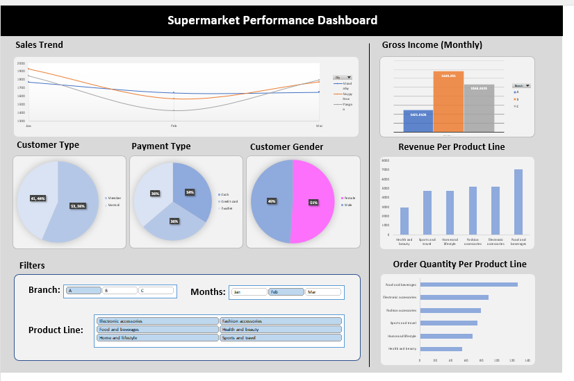

# Supermarket Sales Dashboard



A comprehensive Excel-based dashboard analyzing supermarket sales data from branches in Yangon, Mandalay, and Naypyitaw. This repository provides raw data, pivot tables, and visualizations to uncover trends in revenue, customer demographics, payment methods, and product performance. Ideal for data analysts, business intelligence enthusiasts, and retail insights.

[](https://opensource.org/licenses/MIT)
[](https://www.microsoft.com/en-us/microsoft-365/excel)
[](Supermarket%20Sales%20-%20Dashboard.xlsx)

## Table of Contents

- [Overview](#overview)
- [Data Source](#data-source)
- [Key Visualizations](#key-visualizations)
- [Insights](#insights)
- [How to Use](#how-to-use)
- [Contributing](#contributing)
- [License](#license)

## Overview

This project features a supermarket sales dataset spanning January to March, covering 1000 transactions across three cities in Myanmar. The dashboard highlights key metrics like gross income, product line performance, customer types, and payment preferences. Built using Excel's pivot tables, charts, and slicers for interactive analysis.

Explore trends such as:
- Monthly revenue fluctuations by branch.
- Popular product categories and quantities sold.
- Customer demographics and buying behaviors.

## Data Source

The core data is in `Supermarket Sales - Dashboard.xlsx`, which includes:
- **Supermarket Sales**: Raw transaction data (Invoice ID, Branch, City, Customer Type, Gender, Product Line, etc.).
- Pivot-based sheets for aggregations like Sales Revenue by Time, Customer Type, Gender, Payment Options, Monthly Gross Income, Revenue/Quantity per Product Line.
- An interactive Dashboard sheet.

Data is anonymized and focused on branches A (Yangon), B (Mandalay), and C (Naypyitaw).

## 📈 Dashboard Overview

Our comprehensive dashboard integrates multiple perspectives on supermarket performance:

| Sheet | Purpose |
|-------|---------|
| **Supermarket Sales** | Raw transaction-level data |
| **Pivot Tables** | Pre-built aggregations by time, customer segment, payment method, and product line |
| **Dashboard** | Unified interface with interactive slicers and charts |

---

## Key Visualizations

Below are the core charts from the dashboard, showcasing critical insights:

1. **Monthly Gross Income**  
   Breakdown of gross income by branch, highlighting total performance.  
   

2. **Payment Option**  
   Distribution of payment methods used by customers (Cash, Credit Card, Ewallet).  
   

3. **Quantity Per Product Line**  
   Quantities sold across product categories like Food and Beverages, Electronics, and more.  
   

4. **Customer Gender**  
   Gender split among customers, showing a near-even distribution.  
   

5. **Revenue Per Product Line**  
   Revenue generated by each product line, identifying top earners.  
   

6. **Customer Type**  
   Proportion of Member vs. Normal customers.  
   

7. **Dashboard**  
   The full interactive overview combining all metrics with filters for branches, months, and product lines.  
   

## Insights

- **Revenue Trends**: Total gross income stands at approximately $15,379, with Food and Beverages leading at $7,391 in revenue.
- **Customer Demographics**: 56% Members and 44% Normal customers; slightly more females (51%) than males (49%).
- **Product Performance**: Food and Beverages have the highest quantity sold (115 units), while Fashion Accessories generate the most revenue.
- **Payments**: Even split between Cash (36%), Credit Card (32%), and Ewallet (32%).
- **Branch Comparison**: Branch B (Mandalay) shows the highest monthly gross income.

These visuals reveal opportunities for targeted marketing, inventory optimization, and customer loyalty programs.

## 🎯 Key Features

- **Interactive Dashboard** with real-time filtering across branches, timeframes, and product categories
- **7 Core Visualizations** capturing revenue trends, customer demographics, and payment patterns
- **Pivot Table Architecture** enabling custom aggregations and flexible data exploration
- **1,000 Anonymized Transactions** spanning January–March across Yangon, Mandalay, and Naypyitaw
- **Zero Dependencies** — Works seamlessly with Excel 2016+ without additional software

---

## 📁 Repository Structure

```
├── Supermarket Sales - Dashboard.xlsx   # Master workbook with all sheets
├── assets/
│   └── images/
│       ├── dashboard.png
│       ├── Monthly Gross Income.png
│       ├── payment option.png
│       ├── Quantity Per Product Line.png
│       ├── customer gender.png
│       ├── Revenue Per Product line.png
│       └── customer type.png
├── README.md
└── LICENSE
```

---


## 🔍 Key Insights at a Glance

### 💰 Revenue Performance
- **Total Gross Income**: $15,379
- **Top Revenue Generator**: Food & Beverages ($7,391)
- **Branch Leader**: Mandalay shows strongest monthly performance

### 👥 Customer Intelligence
- **Membership Breakdown**: 56% Members vs. 44% Non-members
- **Gender Split**: 51% Female, 49% Male (balanced demographic)
- **Buying Patterns**: Distinct preferences by location and customer type

### 🛍️ Product Insights
- **Best Seller by Volume**: Food & Beverages (115 units)
- **Highest-Revenue Category**: Fashion Accessories
- **Full Product Range**: Food, Electronics, Health, Beauty, Sports, Fashion Accessories

### 💳 Payment Preferences
- **Cash**: 36%
- **Credit Card**: 32%
- **E-Wallet**: 32%
- *Customers embrace diverse payment methods equally*

---


## How to Use

1. **Clone the Repository**:  
   ```
   git clone https://github.com/yourusername/Supermarket_Sales_Data.git
   ```

2. **Open the Excel File**: Use Microsoft Excel (2016+) to view `Supermarket Sales - Dashboard.xlsx`. Interact with slicers on the Dashboard sheet for filtered views.

3. **Analyze Data**: 
   - Explore raw data in the "Supermarket Sales" sheet.
   - Use pivot tables in other sheets for custom aggregations.
   - Generate your own charts or export to tools like Power BI for advanced analysis.

4. **Requirements**: No additional software needed beyond Excel. For scripting, Python with pandas/openpyxl can be used to process the data programmatically.

## Contributing

Contributions are welcome! To add features like additional visualizations or data extensions:
1. Fork the repository.
2. Create a feature branch (`git checkout -b feature/AmazingFeature`).
3. Commit your changes (`git commit -m 'Add some AmazingFeature'`).
4. Push to the branch (`git push origin feature/AmazingFeature`).
5. Open a Pull Request.

Please ensure your code follows best practices and includes documentation.

## License

Distributed under the MIT License. See `LICENSE` for more information.

---

For questions or collaborations, reach out via GitHub Issues. Happy analyzing! 📊


